import { Tabs, TabItem } from "@astrojs/starlight/components";

This guide follows one usage example from an empty folder to a branch on GitHub that is ready for a
pull request. The screenshots show what you should see at each step. Your username, folder names and
version numbers differ from these, and that is fine.

The worked example is `rectangle_from`, a function that builds a rectangle from four numbers. The
finished example opens a window, draws a blue banner and writes the banner's four numbers underneath
it.

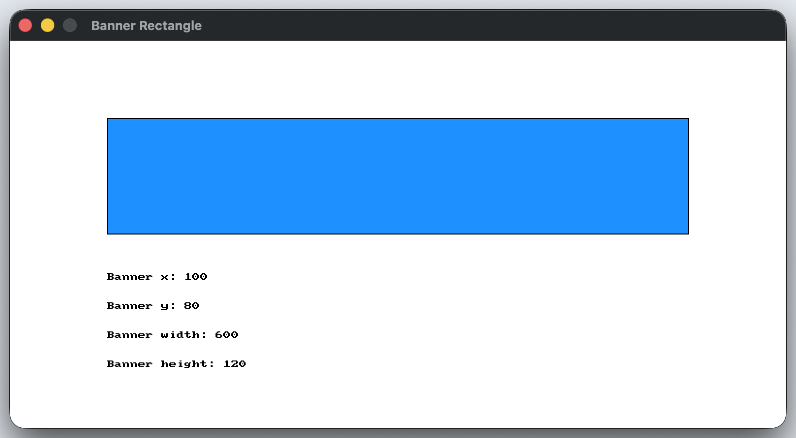

When you finish, you have:

- six files in `public/usage-examples/geometry/`
- a program that runs in C++, in both C# styles and in Python
- a picture of the running window
- one commit on a new branch, pushed to your fork

:::tip[Use your own function]

`rectangle_from` is only an example, so there is something concrete to follow. Someone may have
claimed it by the time you read this, and [step 6](#6-make-sure-nobody-else-has-it) shows how to
check. Use the function from your own task and swap its name in wherever you see `rectangle_from`.

:::

## Before you start

You need:

- a GitHub account
- Git, Node.js with `npm`, VS Code, and SplashKit. The
  [Get Your Environment Set Up](/products/splashkit/02-setting-up) guide walks through each one.
- the [`.NET` SDK](https://dotnet.microsoft.com/download), if you want to test the C# versions

The screenshots come from a Mac. On Windows, use the terminal that the setup guide has you install.
The commands are the same, and the few keys that differ are noted.

Read the
[Guide to creating usage examples](/products/splashkit/documentation/splashkit-website/usage-examples/02-creating-usage-examples)
and the
[Usage Example Style Guide](/products/splashkit/documentation/splashkit-website/usage-examples/05-usage-example-style-guide)
once as well. This guide shows the process. Those two pages hold the rules.

This guide uses VS Code because the setup guide installs it. Any editor works, because the files and
commands are the same.

## Set up the project

### 1. Check your tools

Open a terminal and run each command. Each one should print a version number.

```shell
node --version
npm --version
git --version
dotnet --version
```

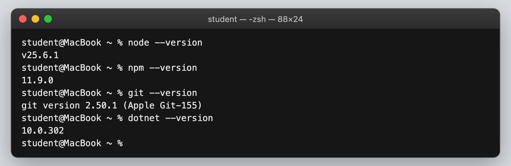

Now check SplashKit's manager tool, `skm`:

```shell
skm help
```

You should see a list of commands that ends with a success message.

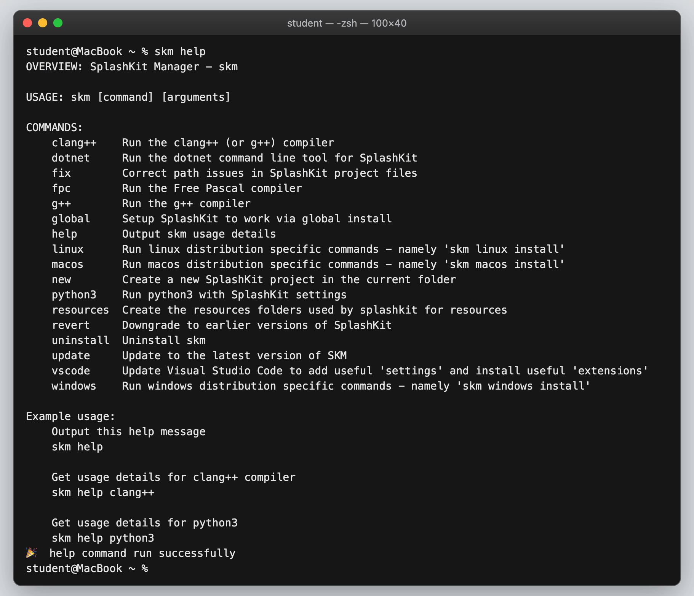

If a command says `command not found`, go back to the
[setup guide](/products/splashkit/02-setting-up). Close and reopen the terminal after installing
something, so it can find the new tool.

### 2. Fork and clone the repository

The team repository is
[thoth-tech/splashkit.io-starlight](https://github.com/thoth-tech/splashkit.io-starlight). You work
on your own copy of it, called a fork, and send your changes back with a pull request. The
[splashkit.io GitHub Guide](/products/splashkit/03-github-guide) shows how to make a fork, with
screenshots.

Then clone your fork. Use your own GitHub username in place of `octocat`:

```shell
git clone https://github.com/octocat/splashkit.io-starlight.git
cd splashkit.io-starlight
ls
```

The download is about 420 MB, so wait for the line that says `Updating files: 100%`.

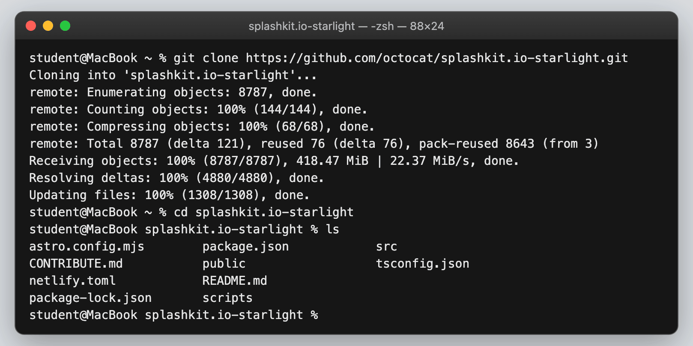

### 3. Open the folder in VS Code

From inside the project folder, run:

```shell
code .
```

If the terminal says `code` isn't found, open VS Code and choose **File → Open Folder** instead.
Select `README.md` in the file list to open it.

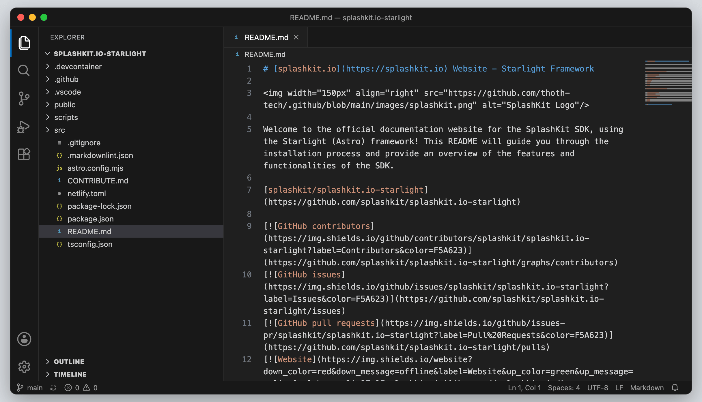

### 4. Install the packages

```shell
npm install
```

This downloads everything the website needs into a folder called `node_modules`. The last lines
mention vulnerabilities. This warning is normal for this project. Do not run `npm audit fix`,
because it rewrites `package-lock.json` and that change would end up in your pull request.

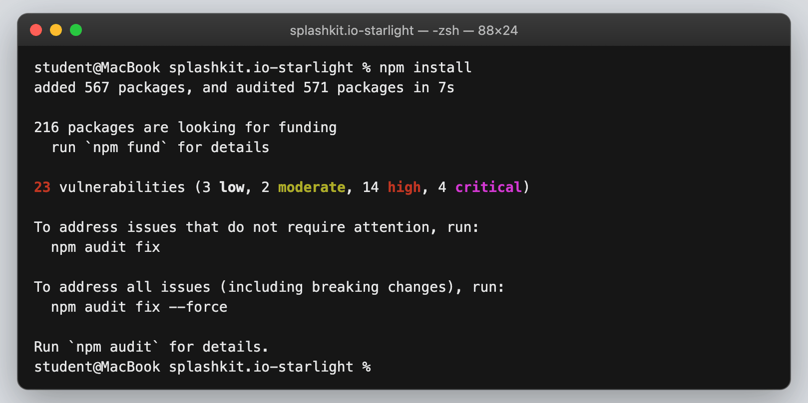

### 5. Start the website on your computer

```shell
npm run dev
```

The first time, it stops with an error:

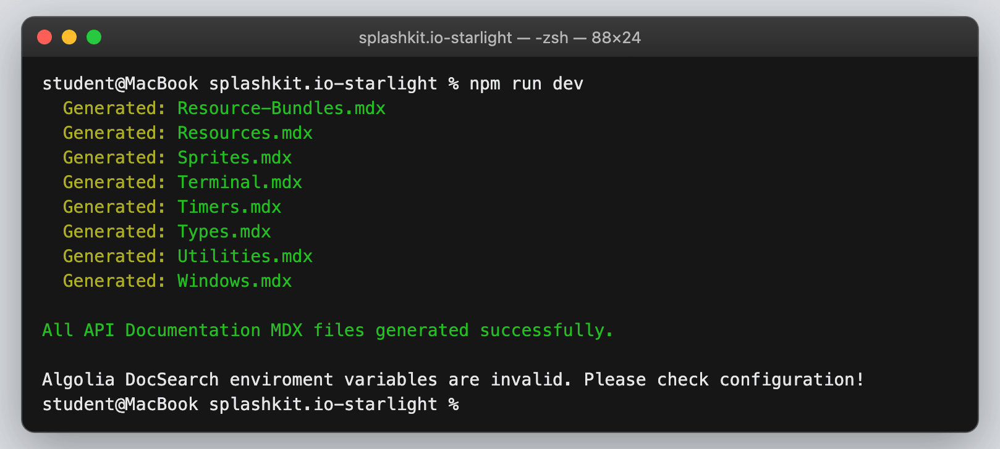

The website's search box needs three settings. You do not need real ones to work on your own
computer, so use placeholders. In VS Code, create a new file called `.env` in the top folder of the
project, next to `package.json`, with these three lines:

```plaintext
DOCSEARCH_API_ID=placeholder
DOCSEARCH_API_SEARCH_KEY=placeholder
DOCSEARCH_INDEX_NAME=placeholder
```

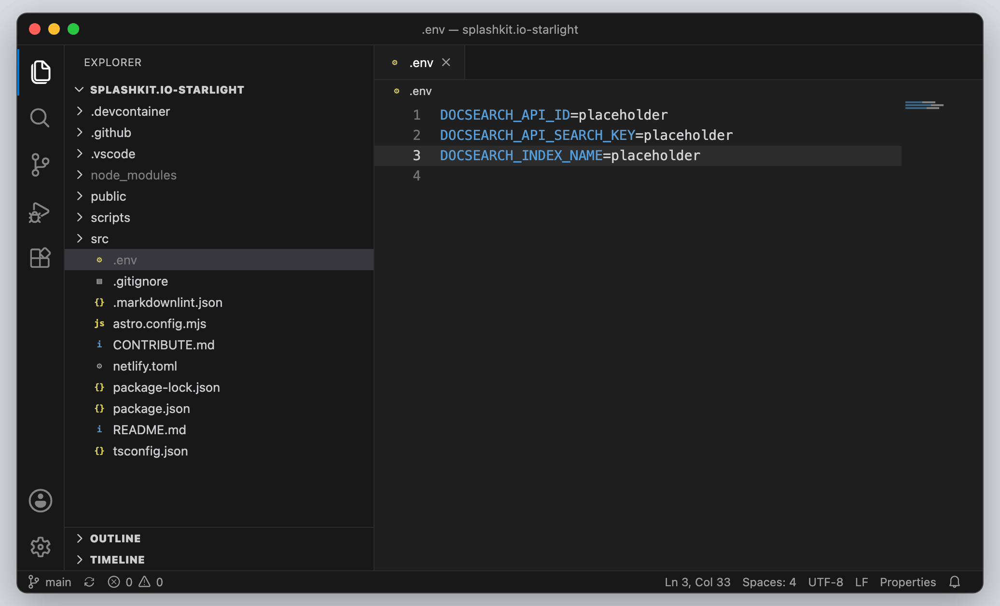

Git ignores `.env`, so it never goes into your commit. The search box does not work on your
computer, and that is fine.

Run the command again:

```shell
npm run dev
```

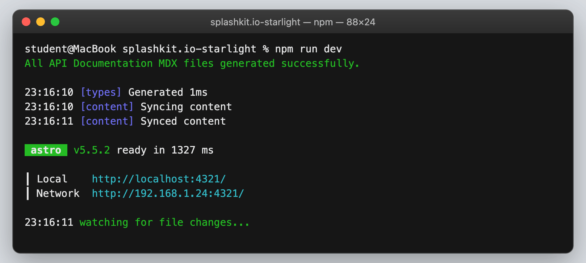

Open [localhost:4321](http://localhost:4321/) in your browser. The SplashKit home page appears.

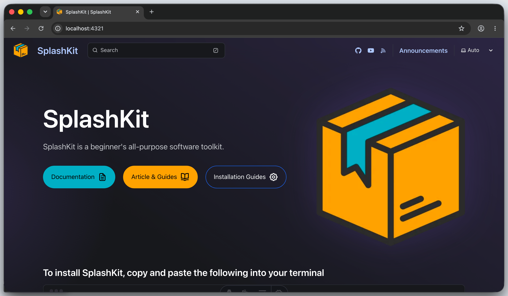

Leave this terminal running. Open a second terminal for everything else. In VS Code, choose
**Terminal → New Terminal**.

:::caution[One file changes by itself]

`npm run dev` and `npm run build` rewrite `scripts/json-files/usage-example-references.json`. Git
then shows it as changed, even though you did not touch it. Put it back with `git restore` before
you commit, and again after every later run:

```shell
git status
git restore scripts/json-files/usage-example-references.json
```

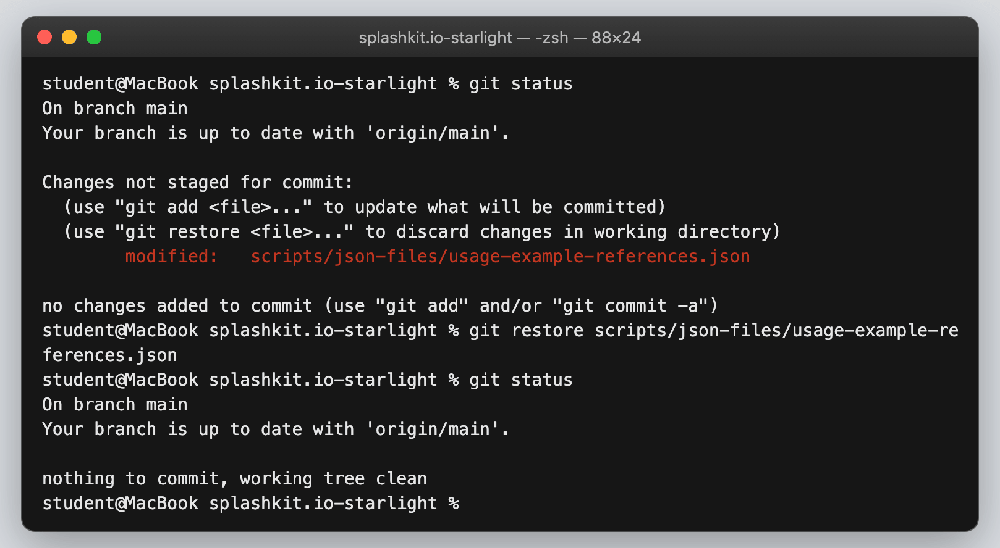

:::

## Choose your function

### 6. Make sure nobody else has it

Two people writing the same example wastes both their time. Check all of these before you write
anything:

- Search the pull requests for the function's name, and include the closed ones. For example,
  [pull requests that mention rectangle_from](https://github.com/thoth-tech/splashkit.io-starlight/pulls?q=is%3Apr+rectangle_from).
- Look on the Planner board for a card with the function's name. The
  [Planner Board Etiquette](/products/splashkit/07-planner-board) page explains how the board works.
- Look in the examples folder. This prints nothing when the function has no example files:

```shell
ls public/usage-examples/geometry | grep rectangle_from
```

Then find the function on your local website. The address is `/api/` followed by the category, then
`#` and the function's name with hyphens. For our function, that is
[localhost:4321/api/geometry/#rectangle-from](http://localhost:4321/api/geometry/#rectangle-from).

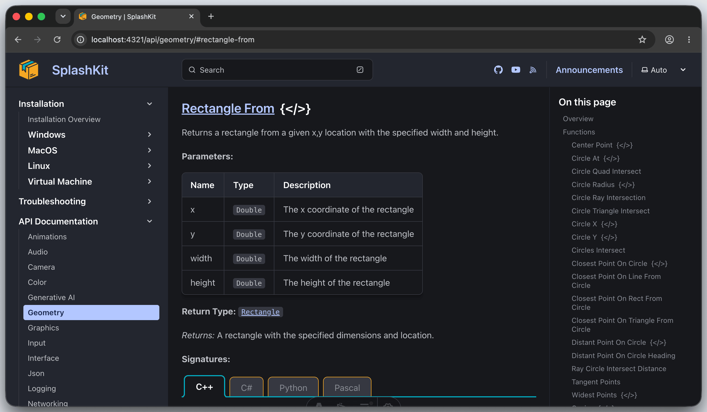

The **See Code Examples** button under **Usage** only appears when example files exist for that
function.

### 7. Find the function's exact name

Example filenames are built from the function's `unique_global_name`. It is the same as the
function's name most of the time. A function with several versions gets a different one for each
version. `rectangle_from` has three.

Open `scripts/json-files/api.json` and search for `"unique_global_name": "rectangle_from"`,
including the closing quote. Press Cmd+F on macOS, or Ctrl+F on Windows and Linux. The `signature` a
few lines above the match shows which version you have found: this one takes `x`, `y`, `width` and
`height`.

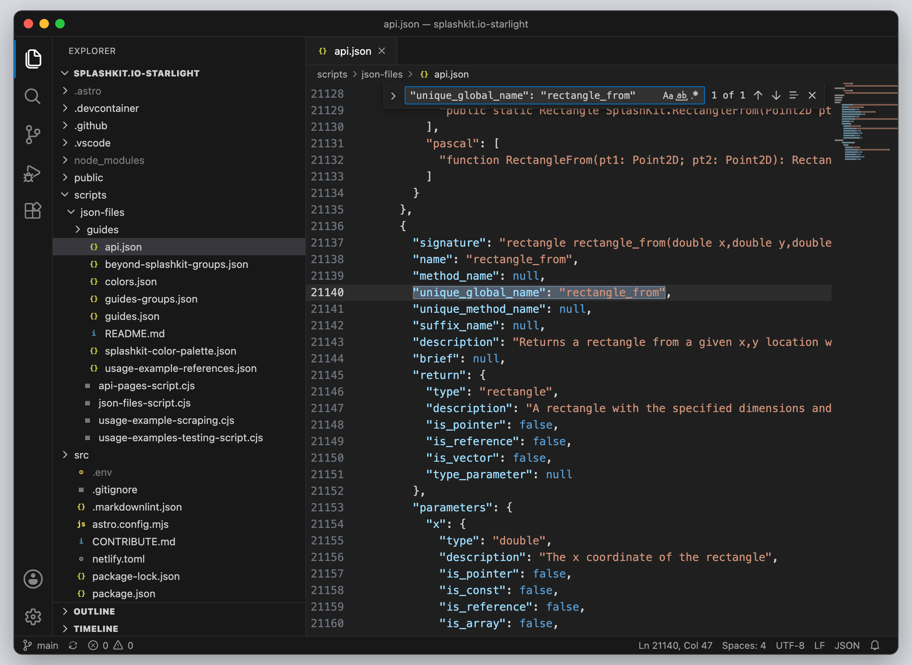

You can also ask the terminal. This prints every name that starts with `rectangle_from`, with its
line number:

```shell
grep -n '"unique_global_name": "rectangle_from' scripts/json-files/api.json
```

The three results are `rectangle_from_point_and_size`, `rectangle_from_points` and `rectangle_from`.
The version that takes four numbers is plain `rectangle_from`, so that is the name for our files.

The category in the website address, `geometry`, is also the name of the folder your files go in:
`public/usage-examples/geometry/`.

### 8. Make a branch

A branch keeps your work separate from `main`. Name it after what it does, and never commit to
`main`.

```shell
git checkout -b add-rectangle-from-example
```

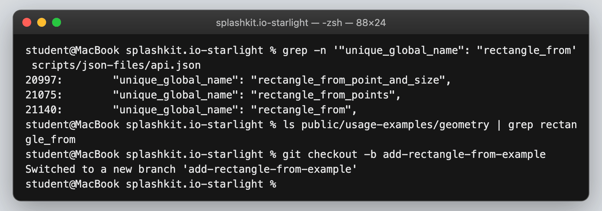

## Write the example

### 9. Create the six files

Every example is six files in the category's folder. The name of each one is the
`unique_global_name`, then `-1-example`, then an ending that says what the file is. The `1` is the
example's number. Use `2` if the function already has a first example.

| File                                    | What goes in it                                           |
| --------------------------------------- | --------------------------------------------------------- |
| `rectangle_from-1-example.txt`          | The title, on one line: `Banner Rectangle`                |
| `rectangle_from-1-example.cpp`          | The C++ version                                           |
| `rectangle_from-1-example-top-level.cs` | The C# version, top-level statements                      |
| `rectangle_from-1-example-oop.cs`       | The C# version, object-oriented                           |
| `rectangle_from-1-example.py`           | The Python version                                        |
| `rectangle_from-1-example.png`          | A picture of the program running (you take it in step 11) |

In VS Code, select the `geometry` folder in the file list, then select the **New File** icon above
the list. Do this for each one. New files show a green **U**, which means Git has not seen them
before. The screenshot below is taken once all six exist. Yours has only five until step 11.

The website shows the title from the `.txt` file as **Example 1: Banner Rectangle**.

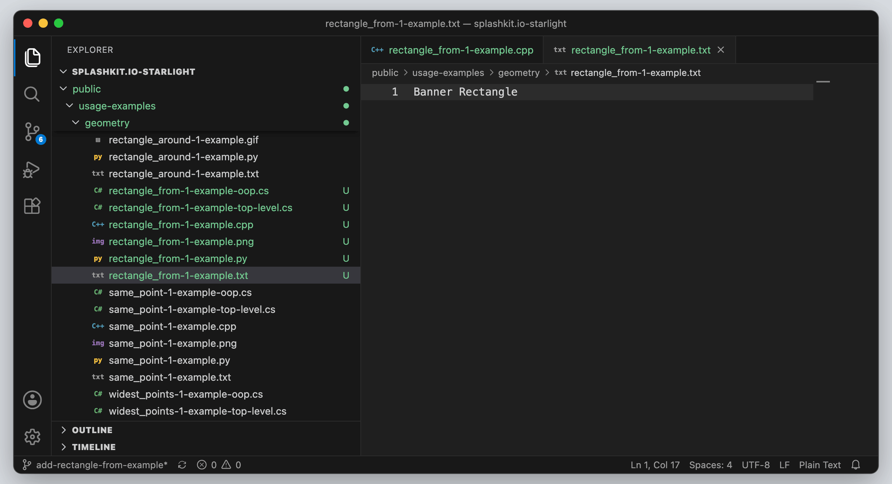

### 10. Write and run each version

All the versions follow the same shape:

1. Open a window with a name that describes the example, not the function.
2. Call the function you are showing (`rectangle_from` in this example) once, before the loop.
3. Loop until the window is closed. Each time round the loop, process events, clear the screen,
   draw, then refresh the screen.
4. Close the windows at the end.

Comments say why the code does something, not what it does. Keep the whole program short enough for
a beginner to read in one go. The
[style guide](/products/splashkit/documentation/splashkit-website/usage-examples/05-usage-example-style-guide)
has the full rules.

:::caution[Run everything from a practice folder]

Building and running leave files behind: `banner.dSYM` folders on macOS, `__pycache__` folders for
Python, and a `logs` folder and a `myeasylog.log` file whenever a SplashKit program runs. Git does
not ignore them in this repository. If you run programs inside the project, they show up in
`git status` and can end up in your commit. Make a `practice` folder next to the project and run
everything from there.

:::

<Tabs syncKey="code-language">
<TabItem label="C++">

Save this as `rectangle_from-1-example.cpp`:

```cpp
#include "splashkit.h"

int main()
{
    open_window("Banner Rectangle", 800, 400);

    // A rectangle record keeps a shape's position and size together in one variable
    rectangle banner = rectangle_from(100, 80, 600, 120);

    while (!quit_requested())
    {
        process_events();

        clear_screen(COLOR_WHITE);

        fill_rectangle(COLOR_DODGER_BLUE, banner);
        draw_rectangle(COLOR_BLACK, banner);

        // The record's fields hold the numbers that were passed in
        draw_text("Banner x: " + to_string(static_cast<int>(banner.x)), COLOR_BLACK, 100, 240);
        draw_text("Banner y: " + to_string(static_cast<int>(banner.y)), COLOR_BLACK, 100, 270);
        draw_text("Banner width: " + to_string(static_cast<int>(banner.width)), COLOR_BLACK, 100, 300);
        draw_text("Banner height: " + to_string(static_cast<int>(banner.height)), COLOR_BLACK, 100, 330);

        refresh_screen(60);
    }

    close_all_windows();

    return 0;
}
```

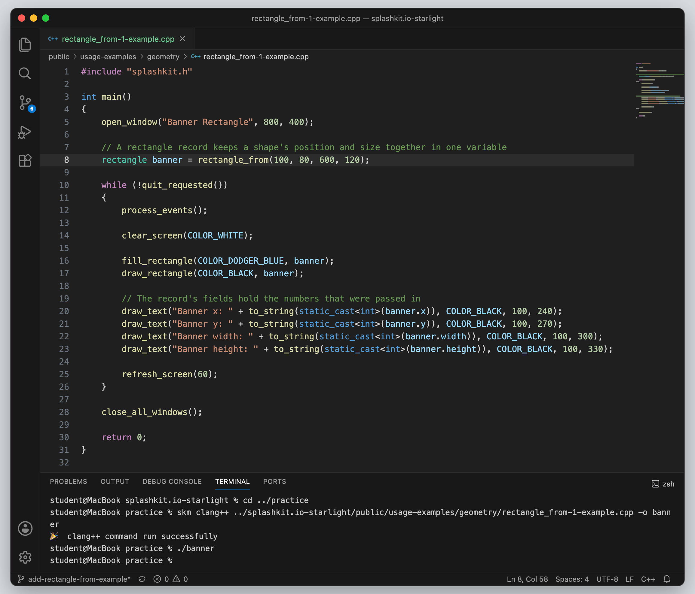

From the project folder, compile and run it in a practice folder:

```shell
cd ..
mkdir practice
cd practice
skm clang++ ../splashkit.io-starlight/public/usage-examples/geometry/rectangle_from-1-example.cpp -o banner
./banner
```

`skm clang++` compiles the file with SplashKit's libraries, and `-o banner` names the program
`banner`. A success message means it compiled. Then `./banner` opens the window. Close the window to
stop the program.

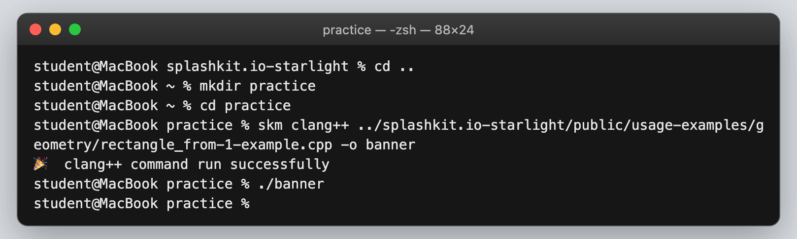

</TabItem>
<TabItem label="C#">

C# has two styles, and every example needs both. Save them as
`rectangle_from-1-example-top-level.cs` and `rectangle_from-1-example-oop.cs`. The top-level version
writes SplashKit's types with a `SplashKitSDK.` prefix, such as `SplashKitSDK.Rectangle`. The
object-oriented version writes every function with a `SplashKit.` prefix.

<Tabs syncKey="csharp-style">
<TabItem label="Top-level Statements">

```csharp
using SplashKitSDK;
using static SplashKitSDK.SplashKit;

OpenWindow("Banner Rectangle", 800, 400);

// A rectangle record keeps a shape's position and size together in one variable
SplashKitSDK.Rectangle banner = RectangleFrom(100, 80, 600, 120);

while (!QuitRequested())
{
    ProcessEvents();

    ClearScreen(ColorWhite());

    FillRectangle(ColorDodgerBlue(), banner);
    DrawRectangle(ColorBlack(), banner);

    // The record's fields hold the numbers that were passed in
    DrawText("Banner x: " + (int)banner.X, ColorBlack(), 100, 240);
    DrawText("Banner y: " + (int)banner.Y, ColorBlack(), 100, 270);
    DrawText("Banner width: " + (int)banner.Width, ColorBlack(), 100, 300);
    DrawText("Banner height: " + (int)banner.Height, ColorBlack(), 100, 330);

    RefreshScreen(60);
}

CloseAllWindows();
```

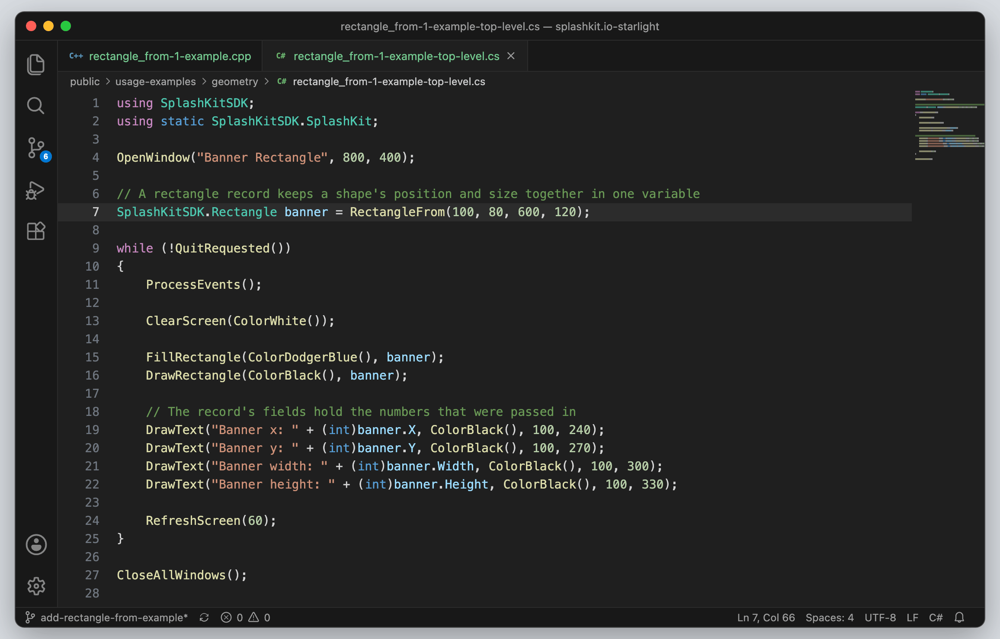

</TabItem>
<TabItem label="Object-Oriented">

```csharp
using SplashKitSDK;

namespace RectangleFromExample
{
    public static class Program
    {
        public static void Main()
        {
            SplashKit.OpenWindow("Banner Rectangle", 800, 400);

            // A rectangle record keeps a shape's position and size together in one variable
            Rectangle banner = SplashKit.RectangleFrom(100, 80, 600, 120);

            while (!SplashKit.QuitRequested())
            {
                SplashKit.ProcessEvents();

                SplashKit.ClearScreen(Color.White);

                SplashKit.FillRectangle(Color.DodgerBlue, banner);
                SplashKit.DrawRectangle(Color.Black, banner);

                // The record's fields hold the numbers that were passed in
                SplashKit.DrawText("Banner x: " + (int)banner.X, Color.Black, 100, 240);
                SplashKit.DrawText("Banner y: " + (int)banner.Y, Color.Black, 100, 270);
                SplashKit.DrawText("Banner width: " + (int)banner.Width, Color.Black, 100, 300);
                SplashKit.DrawText("Banner height: " + (int)banner.Height, Color.Black, 100, 330);

                SplashKit.RefreshScreen(60);
            }

            SplashKit.CloseAllWindows();
        }
    }
}
```

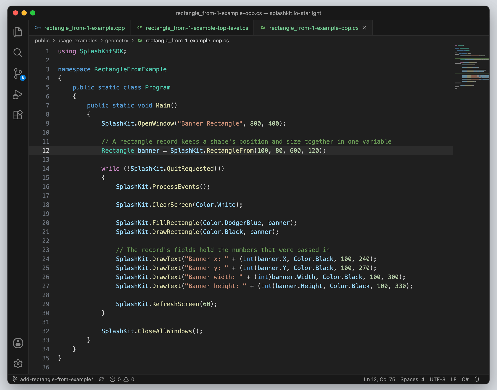

</TabItem>
</Tabs>

To run C# code, make a small project in your practice folder. If you have no practice folder, run
`mkdir practice` next to the project first.

```shell
mkdir banner-csharp
cd banner-csharp
skm dotnet new
```

Open the new `Program.cs`, replace everything in it with one of the versions above, and save. Then
run it:

```shell
skm dotnet run
```

`skm dotnet build` only compiles. `skm dotnet run` compiles and opens the window. The two styles
cannot share one project, so test them one at a time: put the other version into `Program.cs` and
run it again.

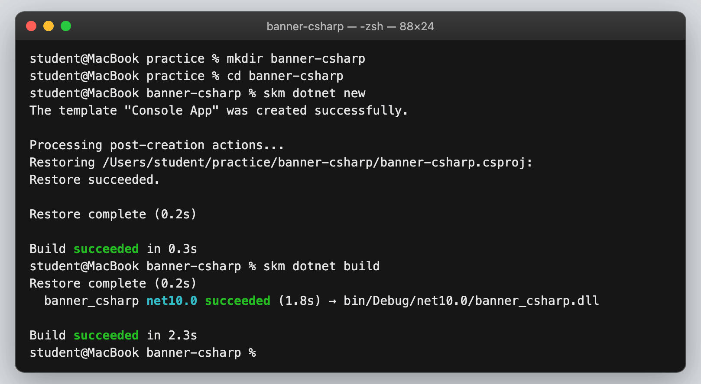

</TabItem>
<TabItem label="Python">

Save this as `rectangle_from-1-example.py`. Python has no overloading, so some SplashKit functions
have longer names in Python: `fill_rectangle_record`, `draw_rectangle_record`,
`draw_text_no_font_no_size` and `refresh_screen_with_target_fps`. Open the Python tab under
**Signatures** on each function's API page to check its exact name.

```python
from splashkit import *

open_window("Banner Rectangle", 800, 400)

# A rectangle record keeps a shape's position and size together in one variable
banner = rectangle_from(100, 80, 600, 120)

while not quit_requested():
    process_events()

    clear_screen(color_white())

    fill_rectangle_record(color_dodger_blue(), banner)
    draw_rectangle_record(color_black(), banner)

    # The record's fields hold the numbers that were passed in
    draw_text_no_font_no_size("Banner x: " + str(int(banner.x)), color_black(), 100, 240)
    draw_text_no_font_no_size("Banner y: " + str(int(banner.y)), color_black(), 100, 270)
    draw_text_no_font_no_size("Banner width: " + str(int(banner.width)), color_black(), 100, 300)
    draw_text_no_font_no_size("Banner height: " + str(int(banner.height)), color_black(), 100, 330)

    refresh_screen_with_target_fps(60)

close_all_windows()
```

From the project folder, copy the file into the practice folder, check it for typos, then run it:

```shell
cd ../practice
cp ../splashkit.io-starlight/public/usage-examples/geometry/rectangle_from-1-example.py .
python3 -m py_compile rectangle_from-1-example.py && echo 'syntax OK'
skm python3 rectangle_from-1-example.py
```

`py_compile` only checks the syntax, so it can not catch a wrong function name. The last command
runs the program through SplashKit. A mistyped function name stops it with a `NameError`.

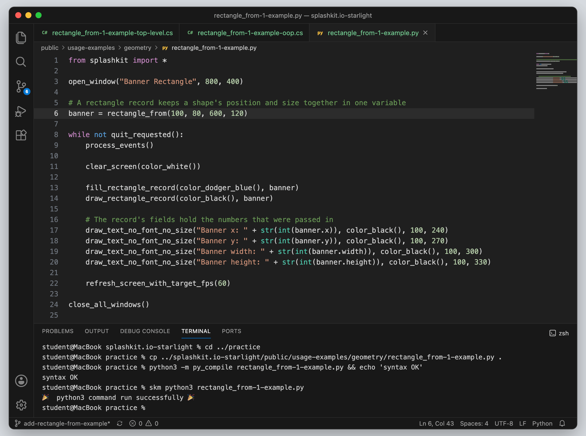

</TabItem>
</Tabs>

### 11. Take the output picture

Every example needs a picture of it running. Use a `.png` for a window that stays still, like this
one, and a `.gif` when something moves or reacts to the mouse or keyboard. Name it
`rectangle_from-1-example.png` and put it in the same folder as the other five files.


Take the screenshot of the running program:

- **macOS:** press Cmd+Shift+4, then Space, then select the example window. Hold Option as you
  select it to leave out the window's shadow. The picture saves to your desktop.
- **Windows:** press Win+Shift+S and drag a box around the window.
- **Linux:** most desktops use Print Screen for the whole screen and Alt+Print Screen for one
  window. Check your desktop's settings.

Check the picture before you keep it:

- It shows the example window and nothing else. No desktop, dock, other windows, notifications or
  file paths.
- Nothing in it names you. A username can hide in a terminal prompt or a window title.
- The window's title describes the example. It is not the function's name.

Rename the file and move it into `public/usage-examples/geometry/`.

## Check your work

### 12. See it on the website

The website builds its list of examples when `npm run dev` starts. Stop the website with Ctrl+C in
the first terminal, then start it again:

```shell
npm run dev
```

Open
[localhost:4321/api/geometry/#rectangle-from](http://localhost:4321/api/geometry/#rectangle-from)
again. Under **Usage** there is now a **See Code Examples** button.

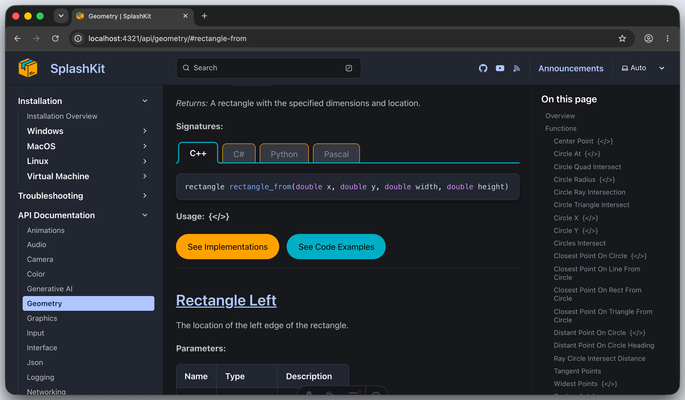

Select it, then check each tab in turn:

<Tabs syncKey="code-language">
<TabItem label="C++">

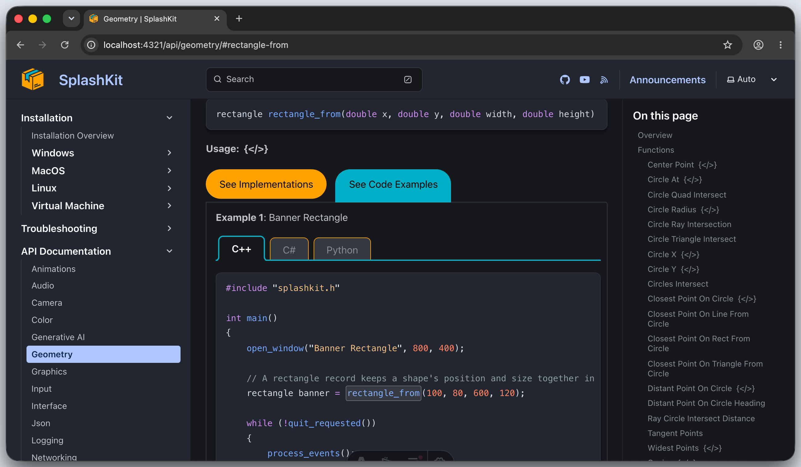

</TabItem>
<TabItem label="C#">

<Tabs syncKey="csharp-style">
<TabItem label="Top-level Statements">

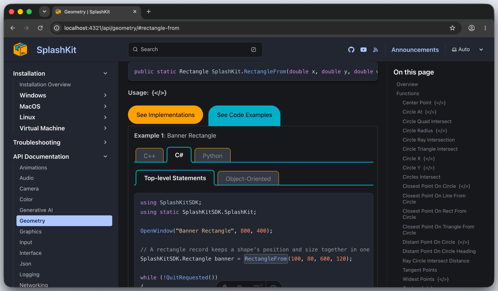

</TabItem>
<TabItem label="Object-Oriented">

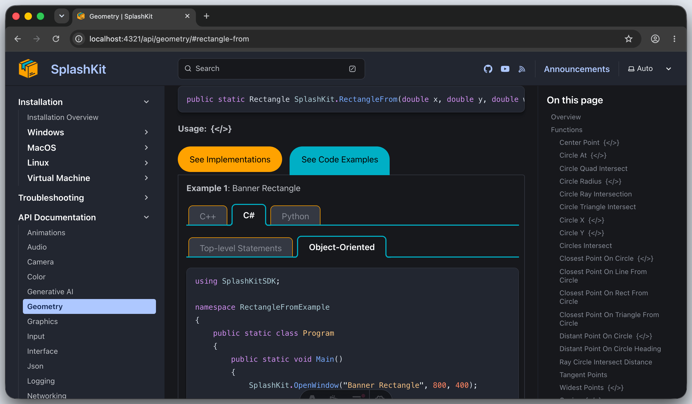

</TabItem>
</Tabs>

</TabItem>
<TabItem label="Python">

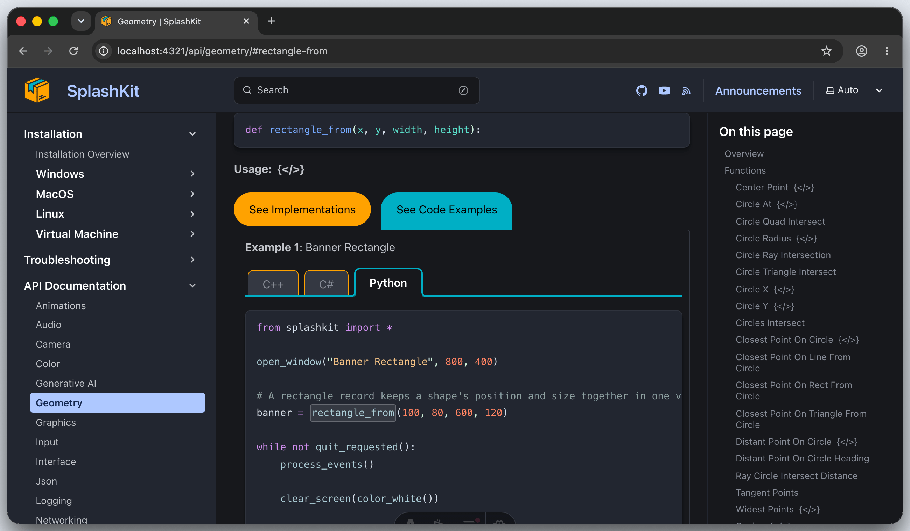

</TabItem>
</Tabs>

Then scroll to the bottom of the example for the **Output** picture.

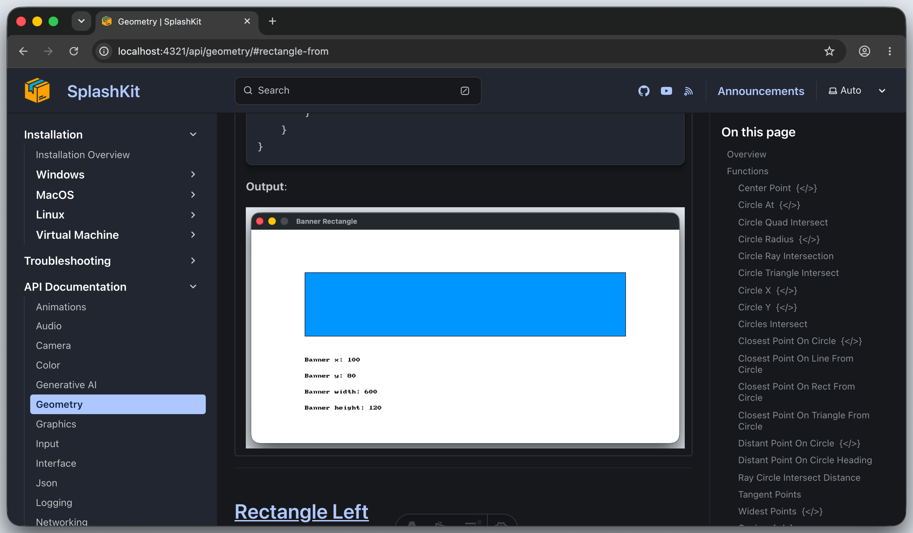

Check these things:

- The heading says **Example 1: Banner Rectangle**, taken from your `.txt` file.
- The C++, C# (both styles) and Python tabs are all there.
- The function's name is highlighted in every tab. If it is not, the name in your code does not
  match. Top-level C# needs `RectangleFrom`, object-oriented C# needs `SplashKit.RectangleFrom`, and
  Python needs `rectangle_from`.
- The picture shows under **Output**.

### 13. Run the build

Before you push, build the whole site the way the hosting service does. The build also checks every
link on the site.

```shell
npm run build
```

It takes a minute or two. Look at the last lines. You want to see `All internal links are valid` and
`Complete!`.

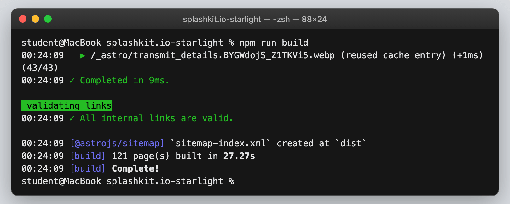

:::note[If the build stops on invalid links]

One broken link anywhere on the site fails the whole build, even if you never touched it. The
message looks like this:

```plaintext
[ERROR] ✗ Found 13 invalid links in 5 files.
▶ api/geometry/
  ├─ /api/geometry/#rectangle-around - invalid hash
  └─ ...
```

If none of the links it lists point at your example, they were already broken before you started.
Check by building a fresh clone of `main`. If it fails in the same way, tell your team and carry on.
If your example is in the list, fix that first.

:::

The build rewrites `scripts/json-files/usage-example-references.json` too, so restore it again
before you commit.

## Send it in

### 14. Commit your files

Put the JSON file back, then add your six files and commit them:

```shell
git restore scripts/json-files/usage-example-references.json
git add public/usage-examples/geometry/rectangle_from-1-example*
git status
git commit -m "Add rectangle_from usage example"
```

The `*` matches all six files and nothing else, so you cannot add stray files by accident.
`git status` should list exactly six new files. Keep the message short, in the same style as the
recent history. The command `git log --oneline -10` shows it.

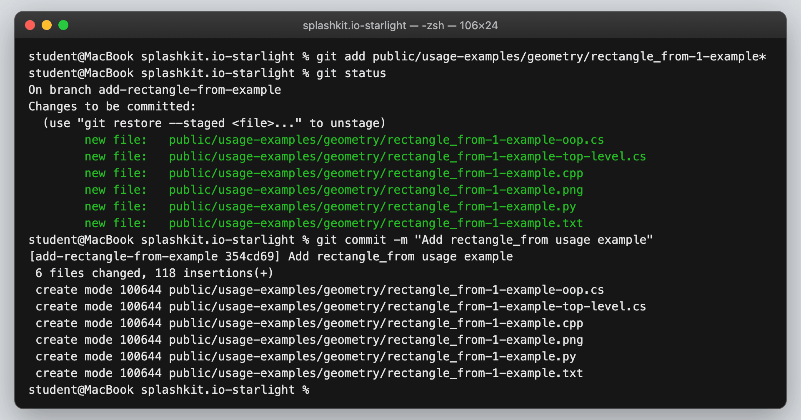

If you prefer buttons, use the Source Control view in VS Code. Check that it lists only your six
files, stage them, type the message, and press **Commit**.

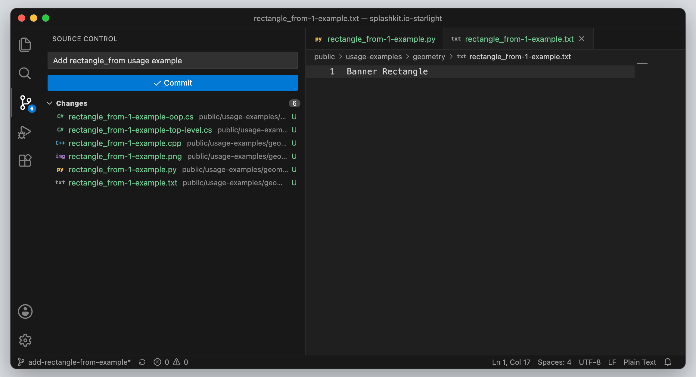

### 15. Push your branch

```shell
git push -u origin add-rectangle-from-example
```

`origin` is your fork. The `-u` remembers the link between your local branch and the one on GitHub,
so a plain `git push` works next time. GitHub also prints a link for opening a pull request.

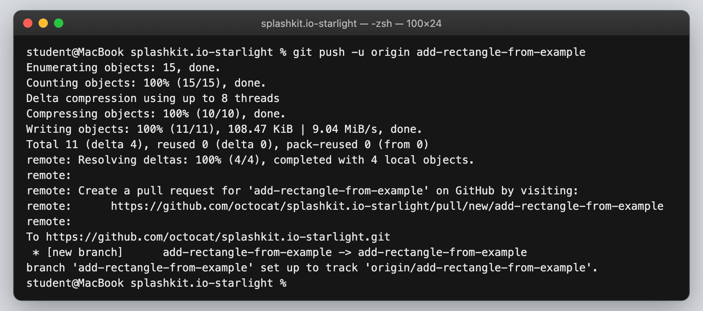

### 16. Open the pull request

Open the link GitHub printed, or go to your fork on GitHub and choose **Compare & pull request**.
Then follow [How to Create a Pull Request](/products/splashkit/04-pull-request) and fill in the
[Pull Request Template](/products/splashkit/05-pull-request-template). Tell your reviewers which
languages you ran.

A teammate then reviews your example. The
[peer review guide for usage examples](/products/splashkit/documentation/splashkit-website/usage-examples/04-usage-peer-review)
shows what they look for. If they ask for changes, edit the files, then run `git add`, `git commit`
and `git push` again. The pull request updates by itself.

## When something goes wrong

| What you see                                                                           | Why it happens                                                                            | What to do                                                                                                |
| -------------------------------------------------------------------------------------- | ----------------------------------------------------------------------------------------- | --------------------------------------------------------------------------------------------------------- |
| `Algolia DocSearch enviroment variables are invalid`                                   | The `.env` file is missing or a line is wrong.                                            | Follow [step 5](#5-start-the-website-on-your-computer). The message's spelling is how the site prints it. |
| `command not found` for `skm`                                                          | SplashKit is not installed, or the terminal was open before you installed it.             | Use the [setup guide](/products/splashkit/02-setting-up), then reopen the terminal.                       |
| `Error: No image, gif or webm (audio) files found for` followed by your example's name | The picture is missing, or its name does not match the `.txt` file.                       | Name it exactly `rectangle_from-1-example.png` (or `.gif`), in the same folder as the `.txt` file.        |
| The same error, for `draw_circle-2-animation` and `draw_circle-3-interactive`          | Those examples on `main` have no picture. They are not yours.                             | Ignore them.                                                                                              |
| No **See Code Examples** button                                                        | The part of the filename before the first `-` is not the function's `unique_global_name`. | Check [step 7](#7-find-the-functions-exact-name), fix the names, then stop and restart `npm run dev`.     |
| The example shows, but its function name is not highlighted                            | The name in the code does not match the function's name in that language.                 | See the checks in [step 12](#12-see-it-on-the-website).                                                   |
| `git status` lists `usage-example-references.json`                                     | The website rewrites it.                                                                  | Run `git restore scripts/json-files/usage-example-references.json`.                                       |
| `git status` lists `banner.dSYM`, `__pycache__`, `logs` or `myeasylog.log`             | You ran a program inside the project folder.                                              | Delete those leftovers, and run programs from your `practice` folder next time.                           |
| `Permission denied` or a `403` error when you push                                     | You are pushing to the team repository instead of your fork.                              | Run `git remote -v`. The `origin` address should have your username in it.                                |
| `npm run build` fails on links you did not touch                                       | The links were already broken.                                                            | See the note in [step 13](#13-run-the-build).                                                             |

## Checklist before you open the pull request

- [ ] The six files are in the right category folder, named `unique_global_name-1-example` plus the
      ending.
- [ ] The `.txt` file has one line, the title. The window's title describes the example.
- [ ] The example runs in C++, in both C# styles and in Python.
- [ ] The Python function names match the Python tab on the API page.
- [ ] The loop is `while (!quit_requested())`, never `while (true)`.
- [ ] Graphical examples show their results in the window and print nothing to the terminal.
- [ ] Comments say why, not what.
- [ ] The picture shows the real window, with nothing personal in it.
- [ ] The function's name is highlighted in every tab on your local website.
- [ ] `npm run build` passes, or fails only on links you did not touch.
- [ ] The commit holds your six files and nothing else.
